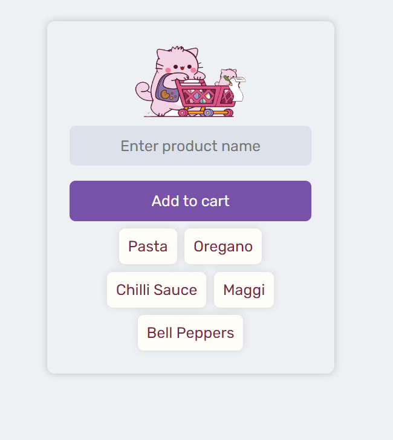

# ShopEase

ShopEase is a web application designed to simplify shopping tasks by providing a user-friendly interface for managing shopping lists and adding items to a virtual cart. The application allows users to input product names, add them to the shopping list, and visually track their shopping progress. ShopEase aims to enhance the shopping experience through efficient organization and easy navigation.

